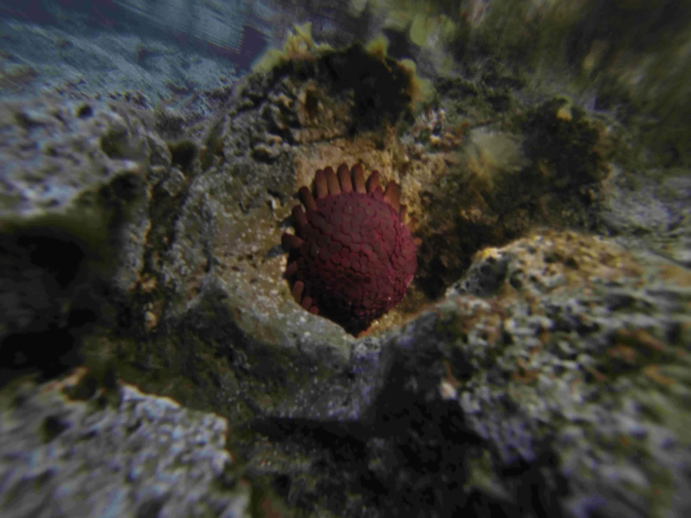
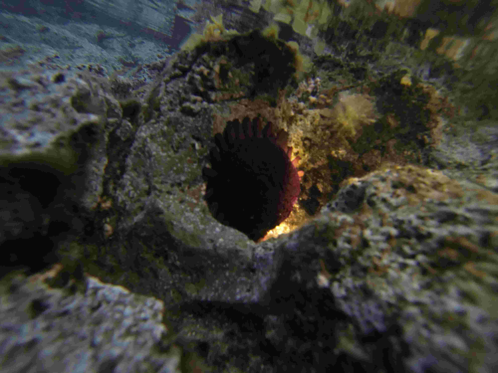
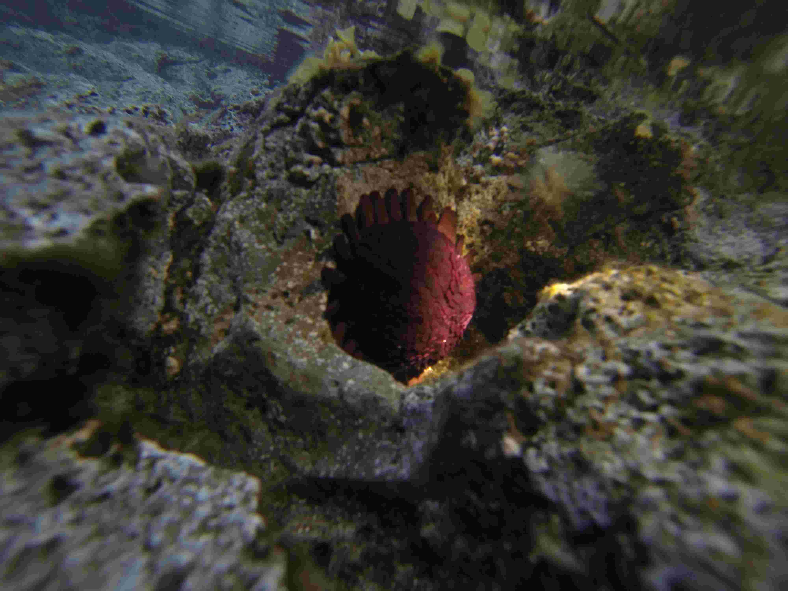
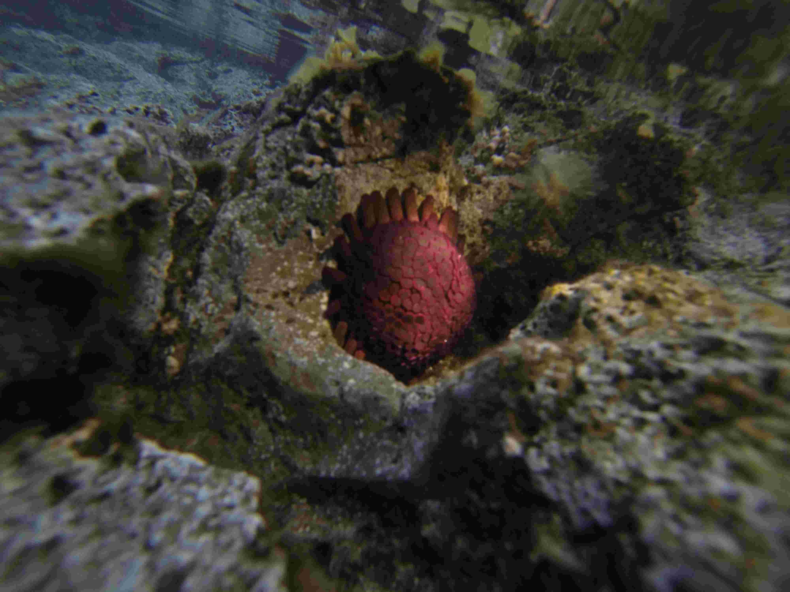
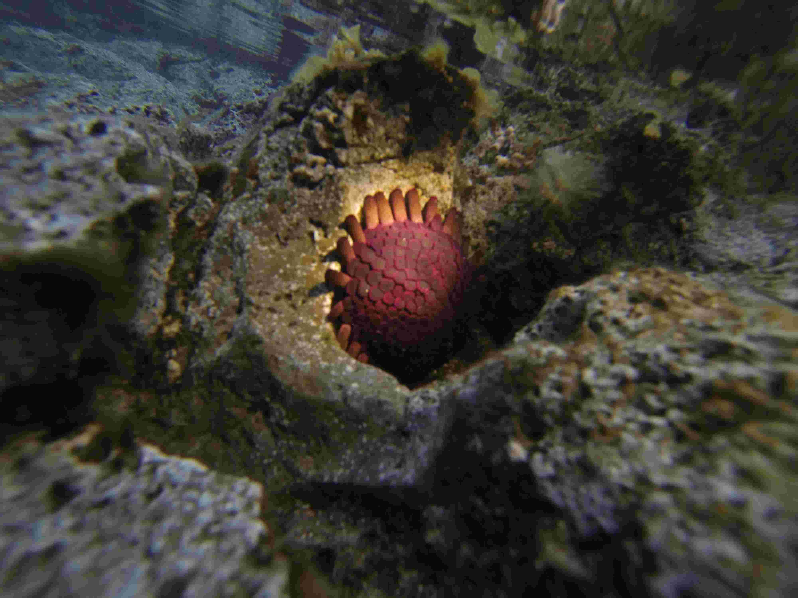

# Useful for Stacking Images in Astrophotography #

> [`mergeimages.py`](./mergeimages.py)

> [`mod_mergeimages_160929.py`](./mod_mergeimages_160929.py)

> [`lighter_stack.py`](./lighter_stack.py)

> [`image.stacking.script.py`](./image.stacking.script.py): Used to create example below.

----
In order to generate the stacked image:

The following 4 images were iterated through, using [`image.stacking.script.py`](./image.stacking.script.py).

   