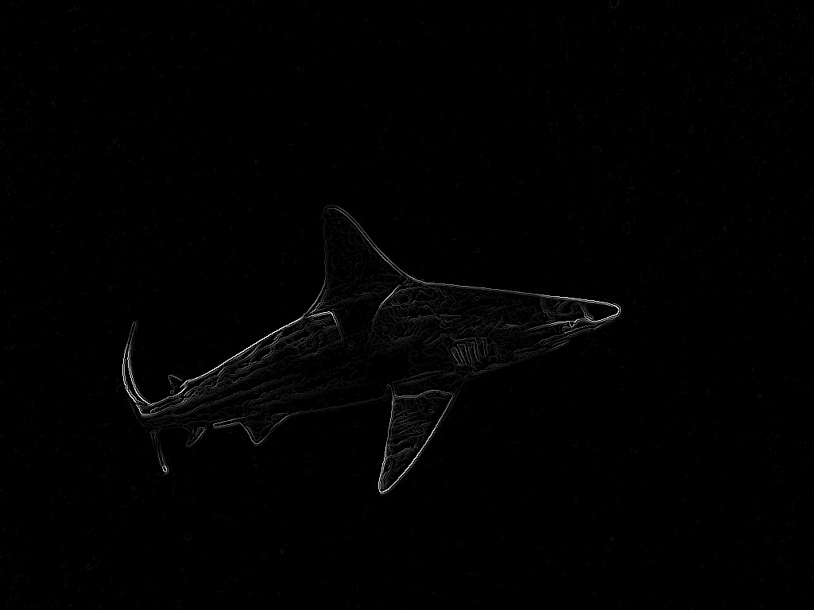
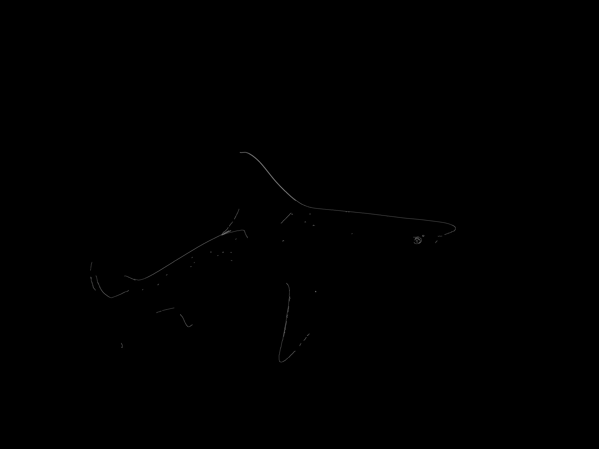
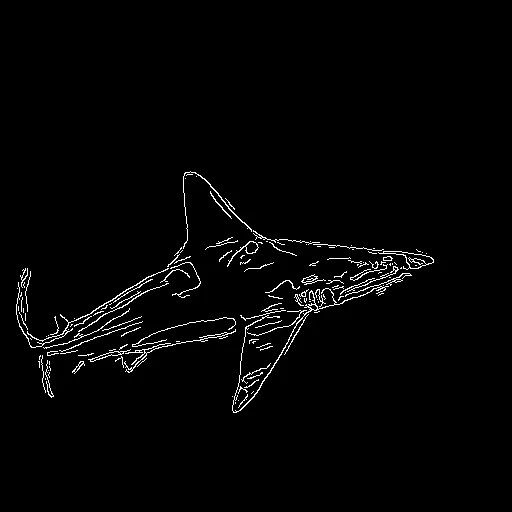

# Edge Detection #

Many models exist and can be easily accessed using API calls to places 
like [huggingface](https://huggingface.co), such 
as [this example.](https://huggingface.co/spaces/kornia/kornia-edge-detection)

Other simple examples can be seen using the input image:<br>


- [sketch_edges.py](../paintings_from_images/scripts/sketch_edges.py) script to make simple edge based sketches:


- [Charcoal_drawing_edge_detect.py](../paintings_from_images/scripts/Charcoal_drawing_edge_detect.py) turn photos into charcoal drawings using canny edge detection:

 

- [edge_sobel_canny_gaussian.py](./edge_sobel_canny_gaussian.py):

<!-- ```py
import cv2
import os

img = "../../figs/zoom_virtual_backgrounds/IMG_3477_1.jpg"
out_path = "../../figs/edge_detection"

# Read the original image
img = cv2.imread(img,flags=0)  
# Blur the image for better edge detection
img_blur = cv2.GaussianBlur(img,(3,3), sigmaX=0, sigmaY=0) 

# Sobel Edge Detection
sobelx = cv2.Sobel(src=img_blur, ddepth=cv2.CV_64F, dx=1, dy=0, ksize=5) # Sobel Edge Detection on the X axis
sobely = cv2.Sobel(src=img_blur, ddepth=cv2.CV_64F, dx=0, dy=1, ksize=5) # Sobel Edge Detection on the Y axis
sobelxy = cv2.Sobel(src=img_blur, ddepth=cv2.CV_64F, dx=1, dy=1, ksize=5) # Combined X and Y Sobel Edge Detection

# Canny Edge Detection
edges = cv2.Canny(image=img_blur, threshold1=100, threshold2=200) 

# Save Sobel and Canny Edge Detection Images
cv2.imwrite(f'{out_path}/Sobel_X.png', sobelx)
cv2.imwrite(f'{out_path}/Sobel_Y.png', sobely)
cv2.imwrite(f'{out_path}/Sobel_X_Y_using_Sobel_function.png', sobelxy)
cv2.imwrite(f'{out_path}/Canny_Edge_Detection.png', edges)
``` -->

Display Sobel X edge detection image
```py
cv2.imshow('Sobel X', sobelx)
cv2.waitKey(0)
```


Display Sobel Y edge detection image
```py
cv2.imshow('Sobel Y', sobely)
cv2.waitKey(0)
```


Display Sobel X Y edge detection image
```py
cv2.imshow('Sobel X Y using Sobel() function', sobelxy)
cv2.waitKey(0)
```


Display Canny edge detection image
```py
cv2.imshow('Canny Edge Detection', edges)
cv2.waitKey(0)
```



Rather than using a Gaussian blur, replace the image with a copy that was passed through [this anime GAN](https://huggingface.co/spaces/akhaliq/AnimeGANv2):
```py
img = cv2.imread(img, cv2.IMREAD_GRAYSCALE) 
img_blur = cv2.imread("../../figs/edge_detection/IMG_3477_1_animeGANv2.png", cv2.IMREAD_GRAYSCALE)
```


