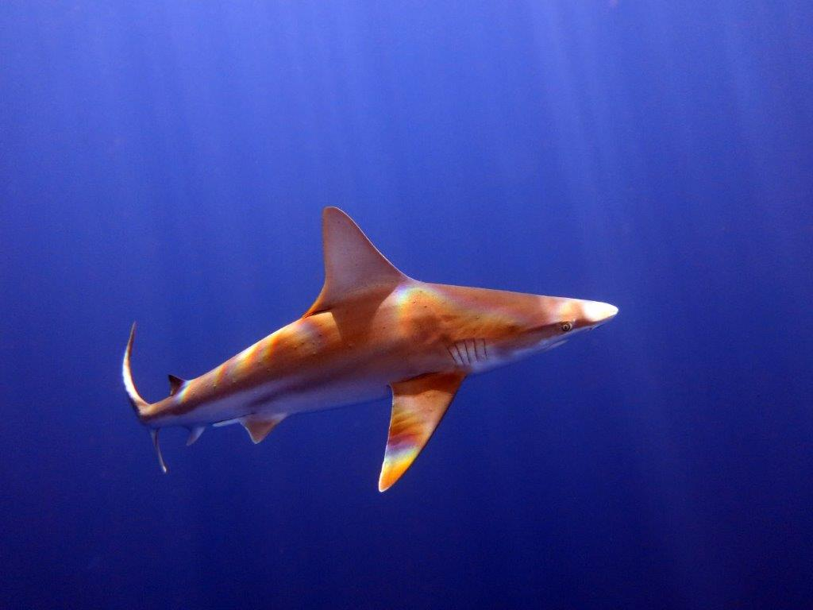
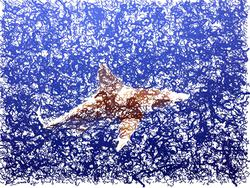

# image-to-paint #

Generate a series of brush-strokes from an image. There are several parameters to vary the style and can also export GCODE for plotting.

This is a cleanup of an old school project from 2012. There are many code and method improvements to be made.

Requires pygame and PIL

----
## Usage ##

```sh
./imageToPaint ../../../figs/zoom_virtual_backgrounds/IMG_3477_1.jpg ../../../figs/paintings/IMG_3477_1_image_to_paint.jpg --brushes 2 4 8 --f_l 0.25
```

```sh
./imageToPaint ../../../figs/zoom_virtual_backgrounds/IMG_3477_1.jpg IMG_3477_1_image_to_paint.jpg --brushes 4 8
```

----
## Example ##

 


----
## Other Options ##
`./imageToPaint -h`

```
usage: imageToPaint [-h] [--brushes BRUSHES [BRUSHES ...]] [--max_len MAX_LEN] [--min_len MIN_LEN]
                    [--f_grid F_GRID] [--colors COLORS [COLORS ...]] [--lightdark LIGHTDARK] [--t T]
                    [--f_l F_L] [--f_c F_C] [--gcode] [--gc_feed GC_FEED] [--gc_tool GC_TOOL]
                    [--gc_width GC_WIDTH] [--gc_height GC_HEIGHT]
                    in out

positional arguments:
  in                    Path to input image.
  out                   Path to where to save output image.

optional arguments:
  -h, --help            show this help message and exit
  --brushes BRUSHES [BRUSHES ...]
                        Size of brushes strokes in pixels. (default: [4])
  --max_len MAX_LEN     Maximum stroke Length. (default: 60)
  --min_len MIN_LEN     Maximum stroke Length. (default: 5)
  --f_grid F_GRID       How spaced apart new strokes will be, 1 = 1*radius_stroke apart. (default: 6)
  --colors COLORS [COLORS ...]
                        Use a limited color palate with color hex codes (ex: '--color 000000 ff0000') to
                        only use black and red (default: ['all'])
  --lightdark LIGHTDARK
                        Paint brush strokes in increasing brightness. (default: True)
  --t T                 Threshold to create a new stroke. (default: 10.0)
  --f_l F_L             Higher values will result in longer, less acurate brushstrokes. (default: 0.75)
  --f_c F_C             Curvature modifier. (default: 1.0)
  --gcode
  --gc_feed GC_FEED     GCODE feedrate.. (default: 600)
  --gc_tool GC_TOOL     GCODE tool. (default: T1)
  --gc_width GC_WIDTH   Width (in inches) for gcode. (default: 46.0)
  --gc_height GC_HEIGHT
                        Height (in inches) for gcode. (default: 46.0)
```
