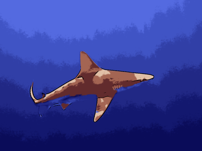

# Convert Photos to Paintings #

```sh
.
├── image_to_paint/
│   └── imageToPaint
├── oil_painting/
│   └── painterfun.py
├── pointillism/
│   └── main.py
└── scripts/
    ├── cartoonify/
    ├── charcoal_drawing_edge_detect.py
    └── sketch_edges.py
```

>  [pointillism/](./pointillism/) creates a painting of the style the dir is named for.

>  [oil_painting](./oil_painting/) is originally from [here](https://github.com/ctmakro/opencv_playground) and is used to turn photos into oil paintings.

>  [image_to_paint/](./image_to_paint/) generates images to look as if the are being built up by brush strokes.

>  [cartoonify/](./scripts/cartoonify/) turns an image into a cartoon style drawing, using k-means clustering.

>  [charcoal_drawing_edge_detect.py](./scripts/charcoal_drawing_edge_detect.py) turn photos into charcoal drawings using canny edge detection.

>  [sketch_edges.py](./scripts/sketch_edges.py) uses cv2 edge detect and a Gaussian blur.

----
## Other Resources ##

> The neural nets used in [runwayml](https://app.runwayml.com/) need to be optimized using newer techniques, but are overall pretty great.  A free account allows you to modify images and videos in a variety of styles.  Their source code is linked for each model, to test it out go to [adaptive-style-transfer.](https://github.com/CompVis/adaptive-style-transfer)


> [stylized-neural-painting](https://github.com/jiupinjia/stylized-neural-painting) can be cloned [here.](https://github.com/jiupinjia/stylized-neural-painting)

> [oil_painting](https://github.com/ctmakro/opencv_playground) can be cloned [here.](https://github.com/ctmakro/opencv_playground)