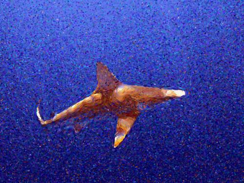

# Pointillism #
This repo contains a python application that converts a photo to a pointillist painting.

You can find information about the algorithm here.](https://medium.com/@matteoronchetti/https-medium-com-matteoronchetti-pointillism-with-python-and-opencv-f4274e6bbb7b)

----
## Execution ##
Python 3.8 environment needed for specific opencv version.  Steps to run code:
1. ```sh
    pip install -r requirements.txt
    ```
2. ```sh
    python main.py --stroke-scale=0 --palette-size=48 --stroke-scale=2 --gradient-smoothing-radius=0
    ```


