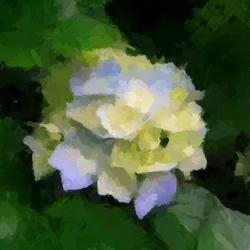
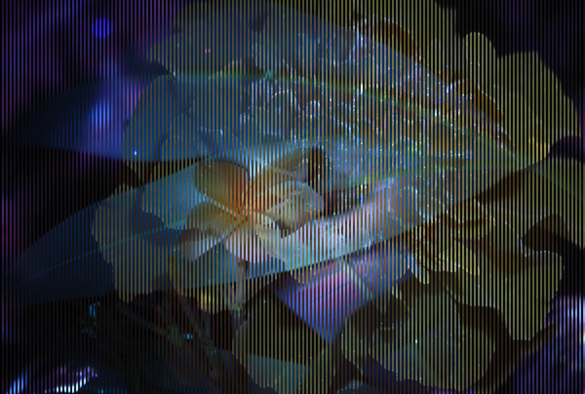

# Image Background Removal #
----
## Usage ##
To remove image backgrounds:
1. Pip install modules: `pip install -r requirements.txt`
2. Run python script: `python rm_image_bkgd.py`
3. Use the GUI to
    - Select the input image
    - Select the destination and name for the output image

----
## Troubleshooting ##
If the script errors out, you can download the model from [here.](https://drive.google.com/uc?id=1tCU5MM1LhRgGou5OpmpjBQbSrYIUoYab) and store it in `${HOME}/.u2net/.`

Once the model is stored locally, rerun the script by following steps 2 and 3 above.

----
## Example ##
The following are paired input and outputs:

