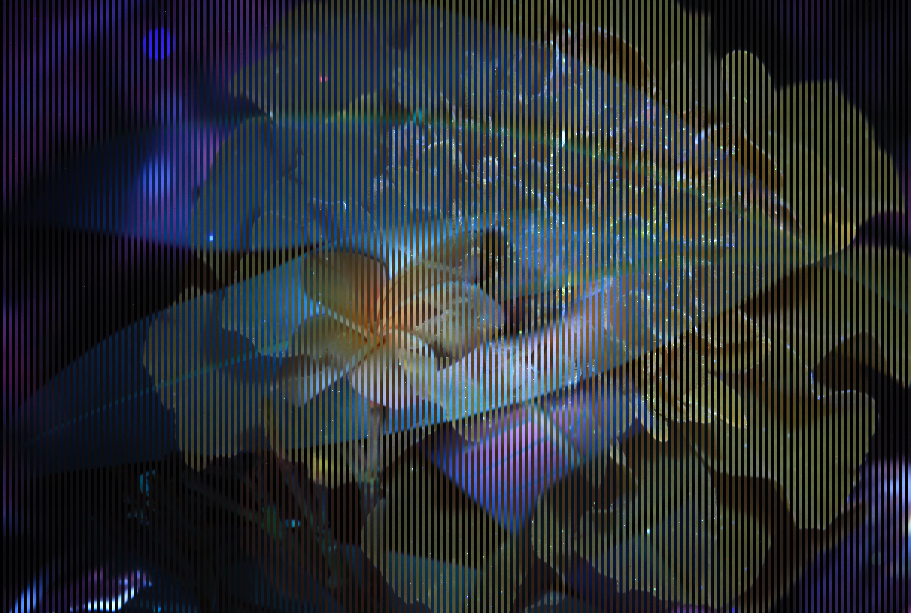
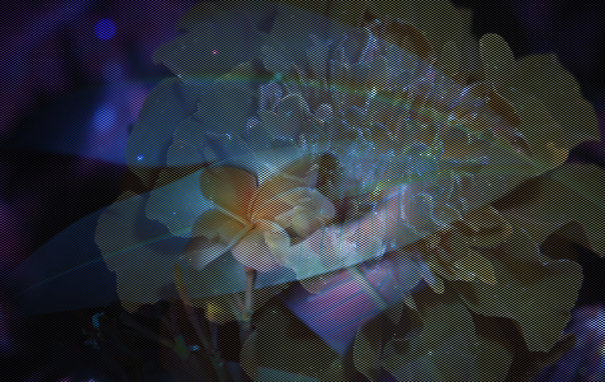

# Tile Mosaic
`runall.sh` is trying to make a tiled image, so each 2x2 box has one image on diagonal and other image on off-diagonal

a.jpg:
a11 a12 ...
a21 a22
...

b.jpg:
b11 b12 ...
b21 b22
...

ab100_ba100_runall.jpg (final image):
a11 b12 ...
b21 a22
...
--OR--
b11 a12 ...
a21 b22
...

----
# Original Images

----
# Vertically Sliced

----
# Tile Mosaic

Steps:
- vertical time slice N images, starting with file `a.jpg`
- vertical time slice N images, starting with file `b.jpg`
- horizontal time slice N images, using ouput of `a.jpg` and `b.jpg` vertical slices