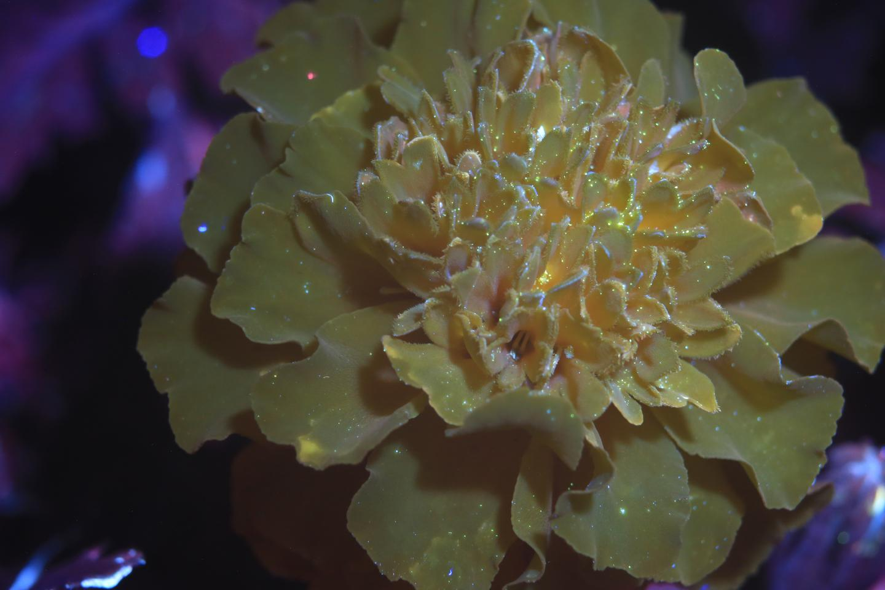

# Tile Mosaic #

### Installation Notes ###
To avoid the error
```sh
AttributeError: module 'scipy.misc' has no attribute 'imread'
```
one must use `scipy==1.1.0` and have install `Pillow`.  Even though `PIL` is not being called imported, 
having it installed removes the `scipy.misc.imread` error.  To ensure all requirements are met, use a 
Python 3.7.13 env, and `pip install -r requirements.txt`.


----
## Usage ##
`runall.sh` is trying to make a tiled image, so each 2x2 box has one image on diagonal and other image on off-diagonal

a.jpg:
a11 a12 ...
a21 a22
...

b.jpg:
b11 b12 ...
b21 b22
...

ab100_ba100_runall.jpg (final image):
a11 b12 ...
b21 a22
...
--OR--
b11 a12 ...
a21 b22
...


----
## Original Images ##
<br>



----
## Vertically Sliced ##


----
## Tile Mosaic ##
<br>
Steps:
- vertical time slice N images, starting with file [`a.JPG`](./figs/a.JPG)
- vertical time slice N images, starting with file [`b.JPG`](./figs/b.JPG)
- horizontal time slice N images, using ouput of [`a.JPG`](./figs/a.JPG) and [`b.JPG`](./figs/b.JPG) vertical slices