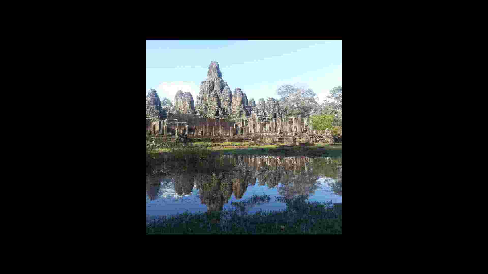
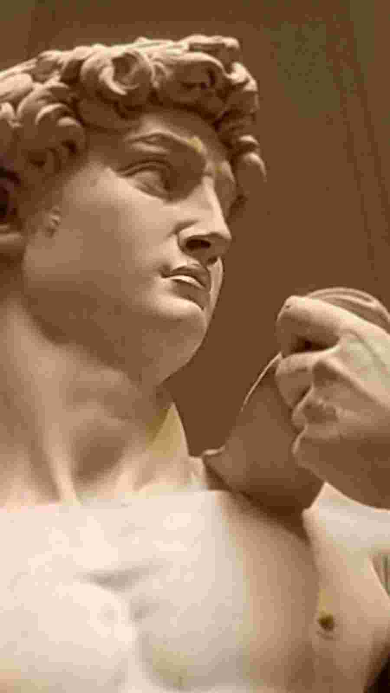
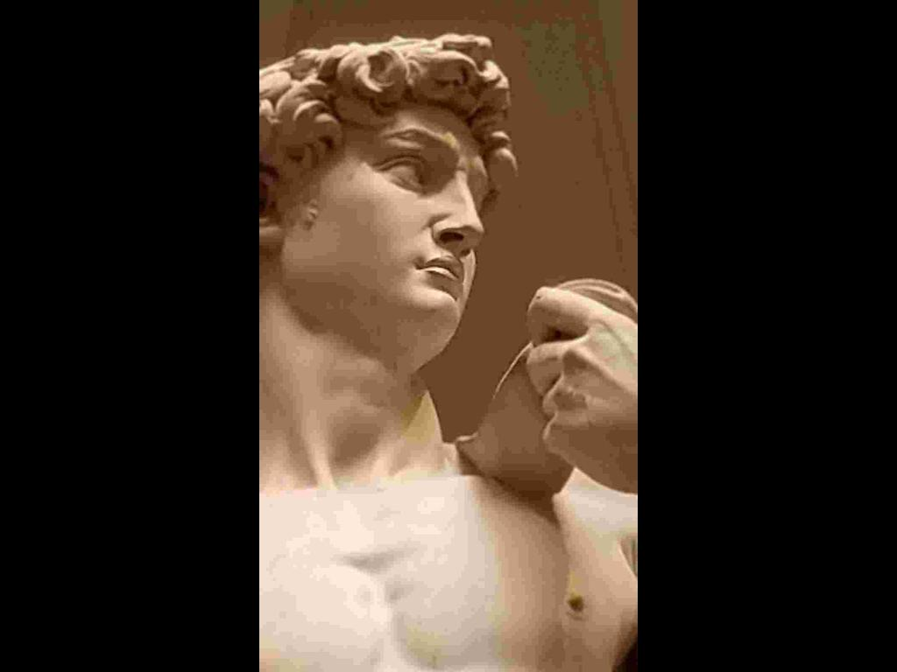

# Modify Images to be Zoom Virtual Backgrounds #

> [`fix_image_size_res.py`](./fix_image_size_res.py): Script to add a black background and save an image with the correct dimensions/resolution.  (Note that a compressed version of this image has been stored on github.)

 &#10140; 

> [`add_bkgd_david.py`](./add_bkgd_david.py): Script to resize an image to the dimensions of one that works and add a black boarder, as needed.

 &#10140; 
